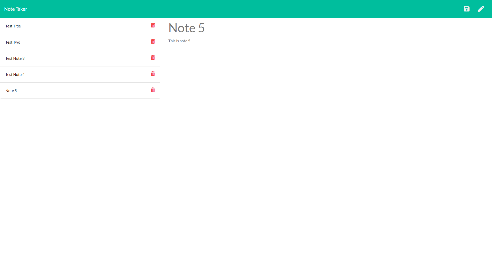

# 11: Express Note Web App

## About
This repo is for BCS assignment 11: Express Note Taker. This is a web application that runs using JavaScript via Express.
The app allows users to read, save, and delete notes to a file on the server.

The HTML pages, CSS style sheet, front-end JavaScript file, and storage file were provided to me as-is. My task for this project was to fill out a server.js file with Express content to make the application work.

When the user navigates the the home page, they are presented with a button that takes them to `/notes`. At this new page, they are presented with a list of existing notes on the left, and a space to write a title and body text for a new note in the remainder of the space. In the top right, there are icon buttons for saving or writing a note. A bin icon in the note list serves as a button to delete a note. All entered URLs other than `/notes` lead to the homepage.

The web app uses `/api/notes` as the API path to GET existing notes and POST new ones. Each note is assigned an ID as well as the title and body text, and this ID is used with the API path `/api/notes/:id` to DELETE a note.

## Preview and Link
This project is also available on Heroku. The address for the Heroku deployment is (https://lit-inlet-27170.herokuapp.com/).

The following image represents the `/notes` page of the web app, which contains the main functionalities.

